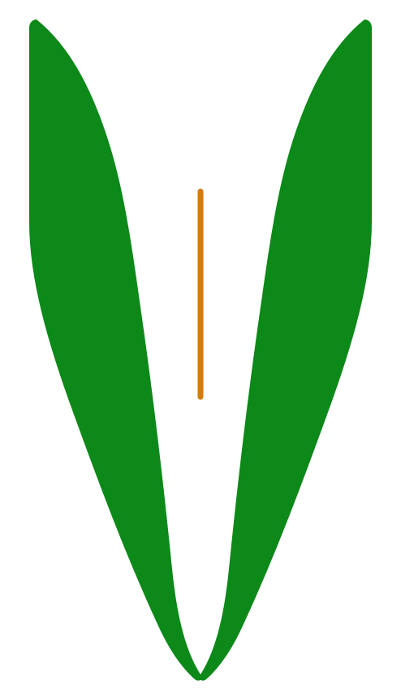

<div align="center">



# VeilHub

**Encrypted links that expire. Share the path, hide the destination.**

`Cloudflare Workers` · `KV` · `AES-GCM` · `PBKDF2` · `Server-rendered HTML/CSS/JS` · `GPL-3.0`

<p>
  
  
  
  
  
</p>

<sub>Last updated: 2026-04-27 08:45 (PDT)</sub>

</div>

---

## Contents

- [What It Does](#what-it-does)
- [Stack](#stack)
- [Release Notes](#release-notes)
- [Architecture](#architecture)
- [Project Structure](#project-structure)
- [Quick Start](#quick-start)
- [Configuration](#configuration)
- [Documentation](#documentation)
- [Security Model](#security-model)
- [Legal Position](#legal-position)
- [Notes](#notes)
- [License](#license)

## What It Does

VeilHub is a self-hosted controlled redirect tool. It turns a target URL into an encrypted, temporary share link operated from a private owner workspace.

It is not a public short-link marketing platform, not a file host, not a VPN, not a blockchain product, and not an anonymity system.

- target URLs are encrypted before storage in Cloudflare KV
- generated links use a configured share domain: `https://<YOUR_SHARE_DOMAIN>/<KEY>`
- creation is private by default behind `APP_ENTRY_PATH`
- the owner workspace uses claim, passphrase login, signed sessions, CSRF tokens, and recovery codes
- links can expire by TTL
- links can be one-time
- links can require an access code
- invalid public probes return controlled request-failed pages instead of exposing internal detail

<figure>

  <figcaption>The screenshot shows an experimental deployment. Colors, labels, layout, and file controls are yours to change — fork the repo and make it your own.</figcaption>
</figure>

## Stack

- Cloudflare Workers — routing, owner auth, session validation, link creation, public redirects, HTML rendering
- Cloudflare KV — encrypted link records, metadata, owner credential records, recovery-code hashes, tombstones, rate-limit counters
- Web Crypto — AES-GCM encryption, PBKDF2-SHA256 hashing, SHA-256, HMAC-SHA256
- Server-rendered HTML, CSS, and JavaScript — no frontend framework, no build step, one Worker deployment surface
- Wrangler — setup, secret upload, KV binding, and deploy

## Release Notes

### 2026-04-26 · VeilHub 1.0.0 Documentation and Public Baseline · 00:01 PDT

- establishes VeilHub as a self-hosted encrypted redirect-link tool, not a hosted public service
- refreshes the README around the BurnBox-style documentation architecture: stack, architecture, project structure, deployment, security, legal position, and notes
- adds a complete public documentation set under `docs/`
- documents four-region legal risk coverage: United States, European Union, China, and Japan
- documents the Cloudflare Workers + KV implementation model
- documents owner claim, owner passphrase, recovery codes, signed sessions, and CSRF protection
- documents AES-GCM target URL encryption and PBKDF2 access-code hashing
- documents repository boundaries and AI deployment handoff rules
- bumps package metadata to `1.0.0`

Developer guidance for this release:

- [Documentation index](docs/README.md)
- [Deployment](docs/deployment.md)
- [Architecture](docs/architecture.md)
- [Threat Model](docs/threat-model.md)
- [Security Design](docs/security-design.md)
- [Legal Risk Statement](docs/legal-risk-statement.md)

<details>
<summary>Current known limitations</summary>

- One-time link consumption is best effort because Cloudflare KV does not provide transactional compare-and-delete semantics for this flow.
- KV-backed rate-limit counters are approximate under concurrency.
- `ENCRYPTION_KEY` rotation breaks existing encrypted links because link records do not store key IDs.
- Public creation mode is disabled by default and requires external abuse controls before public use.
- VeilHub does not protect against Cloudflare platform-level access, malicious deployment operators, browser compromise, or traffic metadata analysis.

</details>

## Architecture

VeilHub 1.0.0 is organized around six layers.

**1. Private owner entry**
The owner workspace is not served from `/`. It lives behind `APP_ENTRY_PATH`, and authenticated private APIs are derived from the same prefix.

**2. Owner-account authentication**
New deployments are initialized through a one-time claim token. After claim, the operator signs in with an owner passphrase. Recovery codes, passphrase change, logout, and session reset live inside the product instead of relying on a permanent deployment token.

**3. Controlled redirect records**
Each share link maps a public key to an encrypted target URL stored in KV. The public key is visible; the target URL is encrypted at rest.

**4. Access controls**
Links can be plain redirects, TTL-limited redirects, one-time redirects, or access-code protected redirects. Access codes are hashed with PBKDF2-SHA256 for new records.

**5. Public share delivery**
Public recipients use `https://<YOUR_SHARE_DOMAIN>/<KEY>`. The Worker validates the link state, optionally verifies an access code, decrypts the target URL, and returns `307`.

**6. Legal and operational boundary**
VeilHub is source code for self-hosting. Each deployment is operated by its deployer. The upstream project author does not operate third-party instances and cannot moderate or remove links from them.

<details>
<summary>Design notes on engineering difficulty</summary>

VeilHub looks small because the repo is small. The difficult part is not rendering a form or returning a redirect. The difficult part is keeping the trust boundary legible.

A redirect link is a capability. If it never expires, it becomes a permanent public pointer. If it exposes the destination too early, it fails the privacy goal. If it hides the destination while pretending to provide anonymity, it overclaims. VeilHub's design keeps those ideas separate:

- the share URL is public
- the target URL is encrypted at rest
- the owner workspace is private by route and session
- the operator remains legally responsible for the deployment
- Cloudflare platform access is outside the protection boundary

The result is intentionally narrower than a short-link SaaS and more explicit than a toy redirect script.

Read more: [Architecture](docs/architecture.md) · [Share Link Delivery](docs/share-link-delivery.md)

</details>

<details>
<summary>Research directions</summary>

VeilHub is also a compact research vehicle for privacy-oriented link infrastructure.

### 1. Keyed Redirects With Bounded Exposure

How should a redirect capability be represented when the target URL should be hidden in storage, but the public link must remain easy to share?

### 2. KV-Backed One-Time Semantics

How far can one-time access be pushed on eventually consistent edge storage before a stronger coordination primitive becomes necessary?

### 3. Operator-Accountable Privacy Tools

How can a small self-hosted tool improve privacy without implying anonymity, lawlessness, or upstream operational control?

</details>

## Project Structure

```text
.
├── README.md                  project overview and first-entry documentation
├── SECURITY.md                vulnerability reporting and security limitations
├── CONTRIBUTING.md            contribution scope and safety rules
├── CHANGELOG.md               user-visible version history
├── LICENSE                    GPL-3.0 license
├── package.json               npm scripts and version metadata
├── wrangler.toml.example      public Cloudflare Worker configuration template
├── scripts/
│   └── setup-deploy.mjs       guided setup: KV, local config, secrets, deploy
├── worker/
│   └── sd.js                  Worker routes, auth, crypto, UI, redirects
├── docs/
│   ├── README.md              documentation index
│   ├── quickstart.md          shortest deployment path
│   ├── deployment.md          complete Cloudflare deployment reference
│   ├── architecture.md        Worker/KV/auth/link architecture
│   ├── share-link-delivery.md public redirect delivery model
│   ├── threat-model.md        protection goals and non-goals
│   ├── security-design.md     crypto, session, CSRF, and headers
│   ├── legal-risk-statement.md
│   ├── privacy-policy-template.md
│   ├── ai-deployment-handoff.md
│   ├── repository-boundaries.md
│   ├── maintenance.md
│   ├── troubleshooting.md
│   ├── release-checklist.md
│   └── development-plan.md
├── torrey/                    legacy/static assets retained for compatibility
├── _headers                   static-host compatibility header file
└── _routes.json               static-host compatibility route file
```

### Runtime Route Map

```text
GET  /<APP_ENTRY_PATH>                 claim, login, or owner workspace
POST /<APP_ENTRY_PATH>/api/claim        first-run owner claim
POST /<APP_ENTRY_PATH>/api/login        owner sign-in
POST /<APP_ENTRY_PATH>/api/recover      recovery-code passphrase reset
POST /<APP_ENTRY_PATH>/api/links        authenticated link creation
POST /<APP_ENTRY_PATH>/api/logout       clear owner session
POST /<APP_ENTRY_PATH>/api/reset-sessions
POST /<APP_ENTRY_PATH>/api/change-passphrase
POST /<APP_ENTRY_PATH>/api/recovery-codes
GET  /favicon.svg                      generated SVG favicon
GET  /<KEY>                            public share-link resolution
```

## Quick Start

If you want an AI assistant to carry out setup with you, start with [AI Deployment Handoff](docs/ai-deployment-handoff.md).

Install dependencies:

```bash
npm install
```

Run guided setup:

```bash
npm run setup
```

The setup script creates or reuses a KV namespace, writes local `wrangler.toml`, generates secrets, uploads them to Cloudflare, deploys the Worker, and prints the private claim URL.

After deploy:

1. open `https://<YOUR_SHARE_DOMAIN>/<YOUR_PRIVATE_ENTRY_PATH>`
2. claim the deployment with the one-time `CLAIM_TOKEN`
3. create the owner passphrase
4. save the recovery codes before closing the page
5. create a test link and verify redirect behavior

Manual setup is documented in [Deployment](docs/deployment.md).

## Configuration

`wrangler.toml` is local deployment state and must not be committed. Use `wrangler.toml.example` as the public template.

| Name | Type | Required | Purpose |
| --- | --- | --- | --- |
| `VEIL_LINKS` | KV binding | Yes | Link records, owner records, recovery hashes, tombstones, rate limits. |
| `ENCRYPTION_KEY` | secret | Yes | Source secret for AES-GCM target URL encryption. |
| `SESSION_SECRET` | secret | Yes | HMAC signing for owner sessions and CSRF tokens. |
| `CLAIM_TOKEN` | secret | First-run setup | One-time deployment claim token. |
| `APP_ENTRY_PATH` | var | Yes | Private owner workspace prefix. |
| `BASE_URL` | var | Recommended | Share-link origin returned to users. |
| `PUBLIC_CREATE_ENABLED` | var | Optional | Anonymous creation toggle; keep disabled by default. |
| `MAX_TTL_SECONDS` | var | Optional | Maximum accepted TTL. |

## Documentation

- [Documentation index](docs/README.md)
- [Quickstart](docs/quickstart.md)
- [Deployment](docs/deployment.md)
- [Architecture](docs/architecture.md)
- [Share Link Delivery](docs/share-link-delivery.md)
- [Threat Model](docs/threat-model.md)
- [Security Design](docs/security-design.md)
- [Troubleshooting](docs/troubleshooting.md)
- [Maintenance](docs/maintenance.md)
- [Privacy Policy Template](docs/privacy-policy-template.md)
- [Legal Risk Statement](docs/legal-risk-statement.md)
- [Repository Boundaries](docs/repository-boundaries.md)
- [AI Deployment Handoff](docs/ai-deployment-handoff.md)
- [Release Checklist](docs/release-checklist.md)
- [Development Plan](docs/development-plan.md)

## Security Model

- target URLs are encrypted at rest with AES-GCM
- owner passphrases and recovery codes are stored as PBKDF2-SHA256 hashes
- access codes for new links are stored as PBKDF2-SHA256 hashes
- owner sessions are HMAC-signed and scoped to the private entry path
- CSRF tokens protect authenticated owner APIs
- private APIs derive from `APP_ENTRY_PATH`
- request-failed pages avoid exposing internal stack traces
- HTML responses include security headers

VeilHub does not protect against:

- malicious operators
- Cloudflare platform-level access
- browser compromise
- traffic metadata analysis
- final destination visibility after redirect
- legal non-compliance by a deployer

Read [SECURITY.md](SECURITY.md), [Threat Model](docs/threat-model.md), and [Security Design](docs/security-design.md) before making security claims about a deployment.

## Legal Position

VeilHub is self-hosted source code, not a hosted service. The project author does not operate third-party deployments and does not control the links created on them.

Before deploying VeilHub for third-party or public use, read:

- [Legal Risk Statement](docs/legal-risk-statement.md)
- [Privacy Policy Template](docs/privacy-policy-template.md)
- [Repository Boundaries](docs/repository-boundaries.md)

If you operate a VeilHub instance, you are responsible for:

- assessing applicable law in your jurisdiction
- publishing operator contact details where required
- responding to abuse, infringement, privacy, or takedown requests
- complying with privacy and data protection obligations
- controlling Cloudflare account access
- deciding whether public creation is lawful and safe for your context

Abuse or legal complaints about a specific third-party deployment must go to that deployment's operator, not to this source repository.

## Notes

VeilHub starts from a small feeling: sharing a path should not always mean giving the whole destination away forever.

The design follows that restraint. It does not try to become a platform, a growth loop, a dashboard full of analytics, or a promise it cannot keep. It is meant to stay close to one person's hands: readable code, visible tradeoffs, a private workspace, expiring capabilities, and documentation that says where the protection ends.

That is also the point of the interface. The colors, labels, layout, and controls are not sacred. They are a first version of a room someone can move into, adjust, and recognize as their own. Fork it, rename the small decisions, change the surface, but keep the boundary honest.

VeilHub is privacy-oriented, but it is not theatrical about privacy. It encrypts target URLs at rest, keeps creation behind an owner-controlled route, lets links expire, and separates access codes from URLs. Those choices are not a spell. They are a set of careful edges around a simple act: passing something along without leaving it exposed forever. It does not claim anonymity, erase traffic metadata, legalize unlawful sharing, or make the upstream author responsible for independent deployments.

The philosophy is simple: make the useful thing small enough to understand, make the dangerous parts explicit, and leave enough room for the next operator to make it their own without pretending the responsibility disappeared. A link can feel temporary, intentional, and human-sized. That is the whole point.

## License

VeilHub is released under [GPL-3.0](LICENSE).

GPL-3.0 governs software licensing. It does not make any deployment legal, compliant, private, or appropriate for a particular use case.

---

<div align="center">

<sub>VeilHub 1.0.0 · Last updated: 2026-04-27 08:45 (PDT)</sub>

</div>
